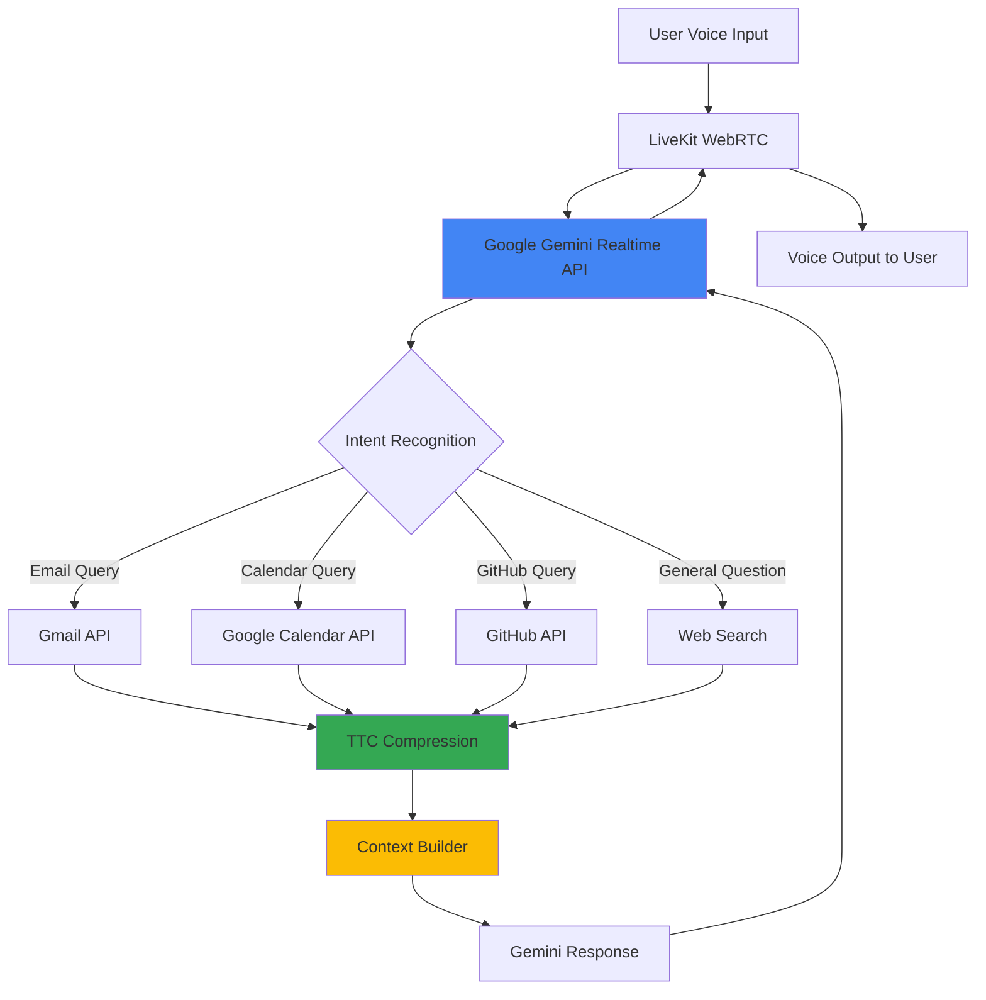

# otto 🎙️

> Your voice-first productivity assistant that unifies your entire workflow

**otto** is an AI-powered voice agent that transforms how you interact with your work tools. Instead of context-switching between GitHub, Gmail, Google Calendar, and countless other platforms, just talk to otto.

**[Devpost](https://devpost.com/software/ntta?ref_content=user-portfolio&ref_feature=in_progress )** waiting on google oauth to deploy.. stay tuned :) for now check out our vid!


---

## 🎯 Inspiration

As software developers and tech professionals, we juggle an overwhelming number of tools and platforms daily:
- GitHub for code reviews and project management
- Gmail for communication
- Google Calendar for scheduling
- Slack, Linear, Jira, and more...

**The problem?** Information is scattered. You need to check three different apps just to answer "What's on my plate today?" Cross-platform references make it impossible to maintain context. We waste hours every week just switching between tools.

**otto solves this.** By voice. In seconds.

Ask otto to "send an email to John about tomorrow's meeting," "what PRs need my review," or "schedule a 1:1 with Sarah next Monday at 3pm" — and it's done. No clicking, no context switching, no friction.

---

## ✨ What it does

otto is your voice-first command center for productivity:

| Feature | Description |
|---------|-------------|
| **📧 Email Management** | Read unread emails, send messages via voice |
| **📅 Smart Scheduling** | Create calendar events with natural language ("tomorrow at 2pm", "next Monday") |
| **💻 GitHub Integration** | Check commits, PRs, issues across your repos |
| **🔍 Web Search** | Quick web lookups when you need external info |
| **📰 Daily Briefing** | AI-generated morning summary of all your services |
| **🎤 Voice-First UX** | Natural conversation powered by Google Gemini Realtime API |

### Example Interactions

```
You: "What's on my calendar today?"
otto: "You have 3 meetings today: Team standup at 10am, 
      Design review at 2pm, and 1:1 with Sarah at 4pm."

You: "Send an email to john@company.com about the deployment"
otto: "Sure, what should the subject be?"

You: "Schedule a meeting called 'Sprint Planning' for next Monday at 10am"
otto: "Done! I've scheduled Sprint Planning for January 20th at 10am."
```

---

## 🏗️ How we built it



### Architecture Overview

| Layer | Technology | Purpose |
|-------|-----------|---------|
| **Frontend** | Next.js 16, React, TypeScript | Dashboard UI and voice interface |
| **Voice Pipeline** | LiveKit Cloud, Google Gemini Realtime | Real-time voice processing (STT, LLM, TTS in one) |
| **Backend APIs** | Next.js API Routes | Service integration and authentication |
| **Agent Runtime** | Python + LiveKit Agents SDK | Tool execution and logic |
| **Authentication** | Supabase Auth | User sessions and OAuth tokens |
| **Text Optimization** | TTC (Token Transport Company) | Token compression for efficiency |

### Key Components

**1. Voice Agent (`agent/main.py`)**
- Google Gemini Realtime Model for natural conversations
- 6 function tools (email, calendar, GitHub, search)
- User context management via LiveKit metadata

**2. Frontend Dashboard**
- Editorial-style daily briefing with AI narrative
- Real-time service integrations
- Interactive token efficiency metrics

**3. API Integrations**
- OAuth-based GitHub, Google Calendar, Gmail access
- Automatic token refresh handling
- Agent-specific authentication via `X-User-ID` header

**4. Text Compression (TTC)**
- Reduces briefing token count by ~70%
- Preserves semantic meaning
- Shown transparently to user

---

## 🚧 Challenges we ran into

### 1. **LiveKit WebRTC Connection**
Integrating LiveKit's WebRTC infrastructure with Next.js was complex. We had to:
- Handle participant metadata to pass user IDs to the agent
- Manage room connections with proper token generation
- Debug audio stream issues between frontend and agent

**Solution:** Created `LiveKitSession` wrapper component and `/api/connection-details` endpoint with Supabase user authentication.

### 2. **Token Company Integration**
Implementing TTC for token compression required:
- Understanding async Python compression workflows
- Handling compression failures gracefully
- Building UI to show compression stats transparently

**Solution:** Created dedicated `ttc_compression.py` module with fallback handling and debug metrics.

### 3. **Calendar Events & Email Sending**
Creating calendar events and sending emails via voice was harder than expected:
- Natural language date parsing ("tomorrow", "next Monday at 3pm")
- Time format conversions (12hr ↔ 24hr)
- OAuth scope management for write permissions
- RFC 2822 email formatting for Gmail API

**Solution:** Built comprehensive date/time parser with 15+ format support and proper OAuth scope configuration.

---

## 🏆 Accomplishments that we're proud of

✅ **6 fully functional voice tools** that actually work in production  
✅ **Real-time voice conversations** with natural language understanding  
✅ **70% token reduction** through smart compression  
✅ **Editorial-style AI briefings** that feel like reading a newspaper  
✅ **Seamless multi-platform integration** (GitHub, Gmail, Calendar)  
✅ **Production-ready authentication** with Supabase OAuth  

---

## 📚 What we learned

- **WebRTC is hard, but LiveKit makes it manageable** — Real-time audio streaming requires careful state management
- **Voice UX is fundamentally different** — Responses must be concise, spoken-length, no markdown
- **Token costs matter** — A 70% reduction via TTC makes a huge difference at scale
- **Natural language is messy** — Parsing "next Monday at 3pm" requires way more code than you'd think
- **Context is everything** — Users want summaries, not raw data dumps

---

## 🔮 What's next for otto

We're building the **ultimate unified workflow ecosystem:**

| Feature | Status | Description |
|---------|--------|-------------|
| **Linear Integration** | 🔜 Planned | Voice access to issues and projects |
| **Jira Integration** | 🔜 Planned | Ticket management via voice |
| **GitLab Support** | 🔜 Planned | Alternative to GitHub |
| **Slack Integration** | 🔜 Planned | Send messages, check channels |
| **Custom Workflows** | 💡 Concept | "When X happens, do Y" automations |
| **Multi-user Workspaces** | 💡 Concept | Team-wide voice assistant |

**Vision:** A single voice interface to replace dozens of apps. Ask otto to "create a Linear ticket for the bug John mentioned in Slack and assign it to Sarah" — and it's done.

---

## 🚀 Quick Start

```bash
# Install dependencies
npm install
pip install -r agent/requirements.txt

# Configure environment
cp .env.example .env.local
# Add your API keys (LiveKit, Google, GitHub, Supabase)

# Start the application
npm run dev  # Frontend (localhost:3000)
cd agent && python main.py dev  # Voice agent

# Connect services at /onboarding
# Click the mic button to start talking!
```

---

## 📊 Tech Stack Summary

**Frontend:** Next.js, React, TypeScript, Tailwind CSS, LiveKit Client  
**Backend:** Next.js API Routes, Supabase  
**Voice:** LiveKit Cloud, Google Gemini Realtime API, Python Agents SDK  
**Integrations:** GitHub API, Google Calendar API, Gmail API  
**Infrastructure:** Vercel (frontend), LiveKit Cloud (voice), Supabase (auth/db)

---

<div align="center">

**Built with ❤️ for developers who deserve better tools**

[View Demo](#) • [Report Bug](#) • [Request Feature](#)

</div>
